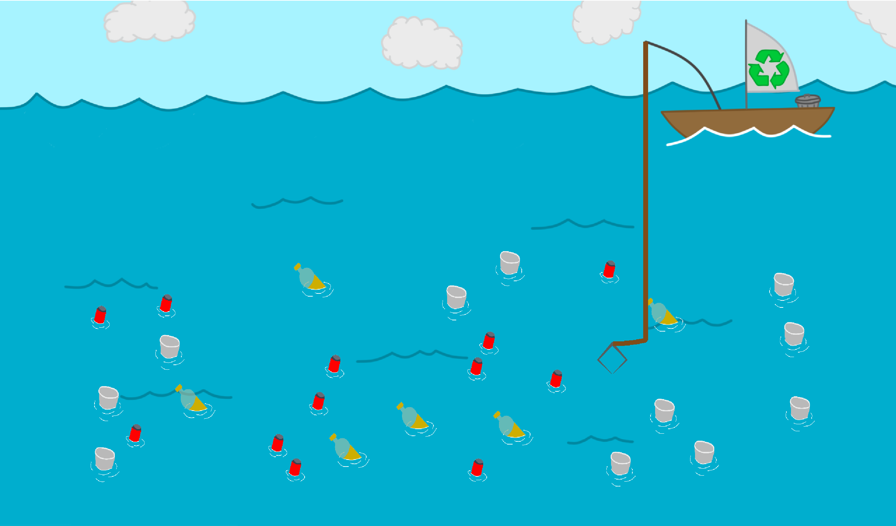
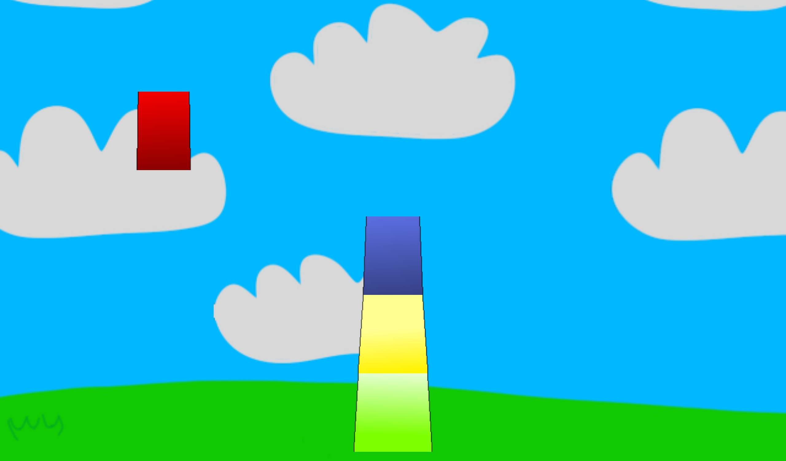
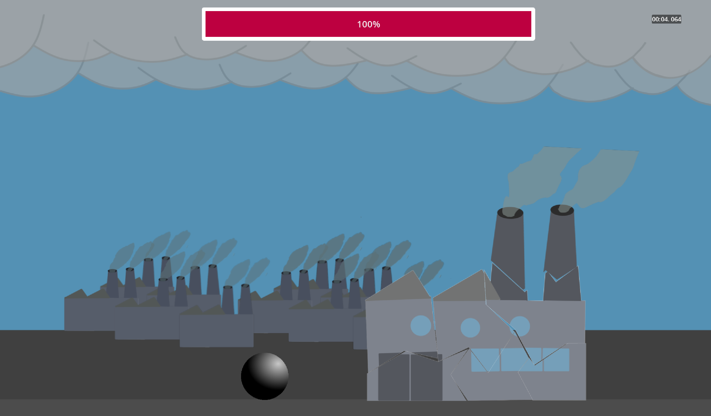
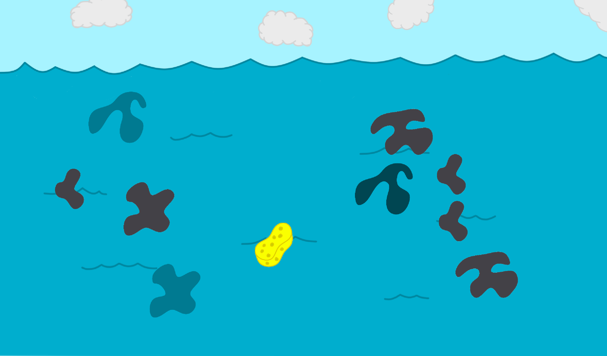

# Educational Game 2 - Save the Climate game
## About the game
- A game to teach you the fundamentals about climate changes.
- Target audience: kids from 6 to 10 years old.
- Teaching the user about climate change with the usage of mini games.

You start the game with a world full of problems ([plastic in the ocean](#plastic-catch), [oil in the ocean](#oil-clean-up) , [overexploitation of fishes](#save-the-fishes) , [factory emissions](#factory-wrecking), [usage of generating power with the usage of carbon](#stacking)), to solve these problems you will have to play mini games.

## Difficulties
- :green_circle: &rarr; easy
- :orange_circle: &rarr; medium
- :red_circle: &rarr; hard
- :warning: &rarr; close to impossible
## Mini games
### Plastic catch

this mini game is how the name implies you will need to catch/fish the plastic out of the water.
This is to signify the :warning:danger:warning: of what plastic does in the ocean.

The danger of plastic in the ocean is that it can harm marine life and ecosystems. Marine animals can mistake plastic for food and ingest it, leading to injury or death. Additionally, plastic pollution can disrupt the balance of marine ecosystems and contribute to the overall degradation of the ocean environment.

How to fish the plastic out of the water:
- pc: hover your mouse over the plastic and it will disappear
- mobile: ...

[Difficulty](#difficulties): :green_circle:
### Stacking

In this mini game, you will create a windmill.To fight of power generation that emits carbon. Windmills have several benefits:
1. Renewable energy source: Wind is a renewable resource, meaning it will never run out.
2. Clean energy production: Windmills produce electricity without emitting harmful pollutants or greenhouse gases.
3. Cost-effective: Once installed, windmills have low operational costs and can generate electricity for many years.
4. Job creation: The wind energy industry creates jobs in manufacturing, installation, and maintenance.
5. Energy independence: Windmills reduce reliance on fossil fuels, promoting energy independence.
6. Climate change mitigation: Wind energy helps reduce carbon emissions, combating climate change.
7. Diverse applications: Windmills can be used to power homes, businesses, and even entire communities.
8. Land use efficiency: Windmills can be installed on land that is also used for farming or other purposes.
9. Scalability: Wind energy can be scaled up to meet the increasing demand for electricity.
10. Visual appeal: Windmills can be seen as iconic structures, adding aesthetic value to the landscape.

How to play this game:
1. choose your [difficulty](#difficulties)
    - :green_circle:Easy 
    - :orange_circle:Medium 
    - :red_circle:Hard 
    - :warning:impossible
2. controls
    - Pc: left-click to drop the windmill part.
    - Mobile: touch the screen.
3. stack until the windmill is fully created

### Forest on fire

this mini game is solely to showcase what climate change can do. and doesn't really provide a good solution to the climate change but rather a solution to the scenario problem.

How to play:
1. controls
    - press space to let the bird fly.

[Difficulty](#difficulties): :orange_circle:

### Factory wrecking

In this mini game we are trying to signify that the factories that are getting used as of today are one of the contributors of emitting the most amount of carbon which is very bad for the environment. So to solve this we destroy these buildings :smiling_imp:.

how to play:
1. you can drag anywhere on the screen to move the ball.
2. try to hit the pieces of the building until they disappear.

[Difficulty](#difficulties): :orange_circle:
### Oil clean up

this mini game has the same concept of gameplay as [plastic catch](#plastic-catch)
the general problem that we are trying to show with this mini game is that because of a lot of oil in the ocean marine lives gets affected which can result in sea life missing there home or mass murder of fishes.

we used the idea sorbents which is a sponge that is used to only pick up oil and not water.

how to play:
1. hover over a sponge and wait for the oil spot to disappear

[Difficulty](#difficulties): :green_circle:
### Save the fishes
# contributors
@BossuytC @SamDw123 @nikitavdc @steellight541
on :office:[github](https://github.com/vives-project-xp/EducationalGame2/)
# Special thanks to
&copy;[NCS](https://www.ncs.io) (NoCopyrightSounds) for allowing us to use there music in our game

[link to the used song(s)](https://youtu.be/HBluMFFdoPk)